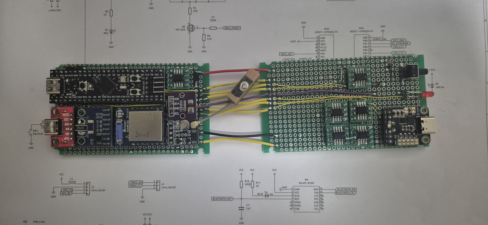
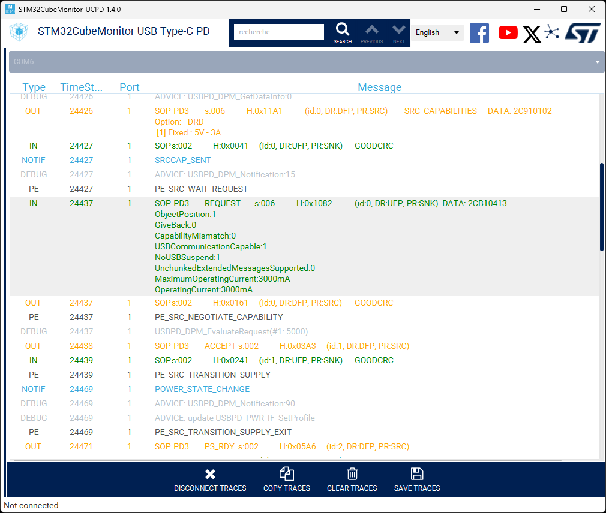
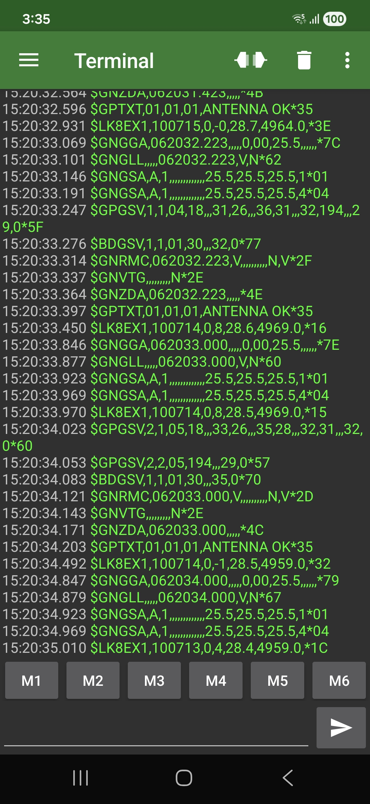
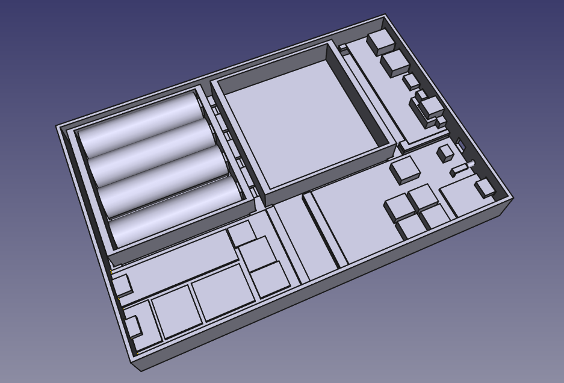
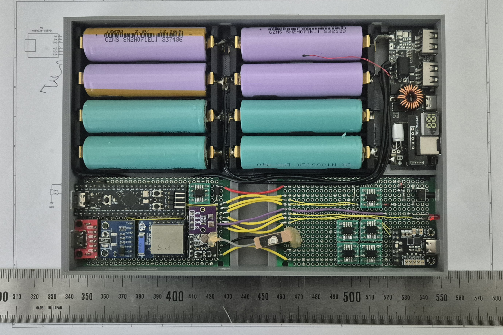

PowerCube
- Power Bank
- GPS
- Variometer
- Bluetooth

Goal: Charge mobile phone while transmitting GPS & Variometer data. It can also support BT connectivity.

 
 

  

    
  

  

    
  

  

    
  

  

    
  

  

    
  

